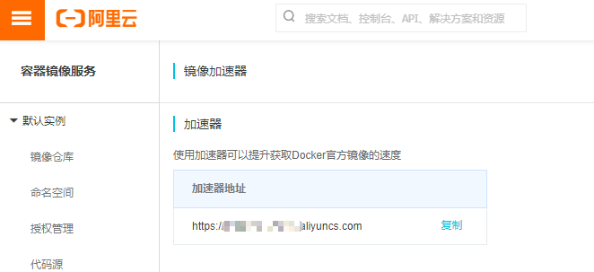

# docker-vuedemo
Docker部署vue项目

先放一波[大佬原文链接](https://juejin.im/post/5cce4b1cf265da0373719819#comment),
大佬已经讲的很详细了，我只把我遇到的问题描述一下

1. 项目目录结构，可以参考我的；
2. docker拉取镜像时速度慢的问题：
- 进入阿里云的[容器镜像服务](https://cr.console.aliyun.com/cn-hangzhou/instances/mirrors)
- 复制加速器的地址

- 在/etc/docker目录下找到在daemon.json文件（没有就新建），将下面内容写入
    ```
    {
    "registry-mirrors": ["https://ruobtvga.mirror.aliyuncs.com"]
    }
    ```
- 重启daemon
    > sudo systemctl daemon-reload
- 重启docker
    > sudo systemctl restart docker

3. server中负载均衡中backend设置  
用的时候，加上`http://`，即：http://backend 
4. 进入容器  
xx可以是容器的id，也可以是容器的names
    > docker exec -it xx bash
